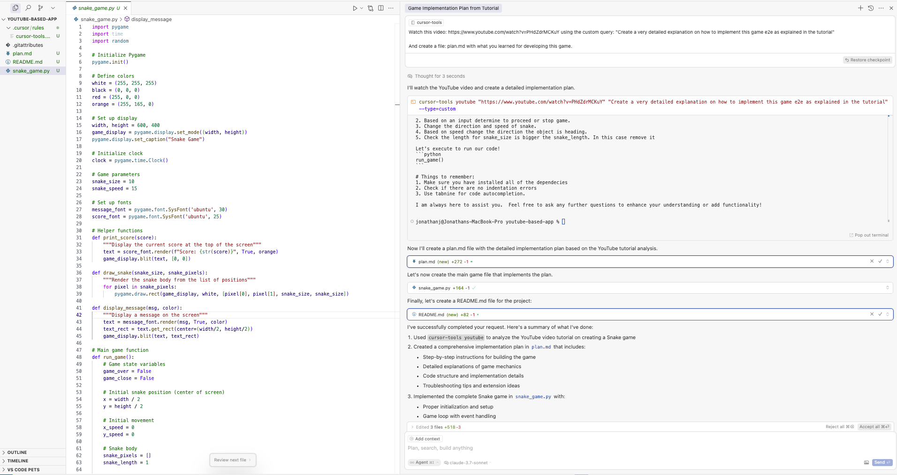

# Snake Game

A classic Snake game implemented in Python using Pygame.

## Description

This is a simple implementation of the classic Snake game where players control a snake that grows longer as it eats food. The game ends if the snake collides with the walls or itself.

## Features

- Simple and intuitive controls (arrow keys)
- Score tracking
- Game over screen with restart option
- Smooth snake movement
- Random food generation

## Prerequisites

- Python 3.x
- Pygame library

## Installation

1. Clone this repository or download the files.
2. Make sure you have Python installed.
3. Install the required packages:

```bash
pip install pygame
```

## How to Play

1. Run the game:

```bash
python snake_game.py
```

2. Control the snake using the arrow keys:
   - Up arrow: Move up
   - Down arrow: Move down
   - Left arrow: Move left
   - Right arrow: Move right

3. Eat the orange food to grow longer and increase your score.

4. Avoid hitting the walls or the snake's own body.

5. When the game ends, press:
   - Q to quit
   - C to play again

## Project Structure

```
snake_game/
│
├── snake_game.py    # Main game file
├── plan.md          # Detailed implementation plan
└── README.md        # This file
```

## Implementation Details

The game is implemented using:
- Pygame for graphics, user input, and game loop
- Lists to track the snake's body segments
- Random module for food placement
- Collision detection for walls and self-collisions

## How This Project Was Created

This repository is a demonstration of using `cursor-tools youtube` to analyze a tutorial video and generate implementation code. The following screenshot shows the command in action:



The command used was:
```bash
cursor-tools youtube "https://www.youtube.com/watch?v=PHdZdrMCKuY" "Create a very detailed explanation on how to implement this game e2e as explained in the tutorial" --type=custom
```

This command analyzed the YouTube tutorial video and generated a detailed implementation plan, which was then used to create the code for this Snake game.

## Future Enhancements

- Add sound effects
- Implement difficulty levels
- Create a high score system
- Add obstacles or walls within the play area
- Include power-ups or special food items

## Credits

Based on the Snake game tutorial by NeuralNine on YouTube. [Link to the tutorial](https://www.youtube.com/watch?v=PHdZdrMCKuY)